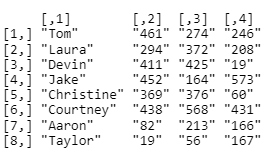

```{r setup, include=FALSE}
knitr::opts_chunk$set(echo = TRUE)
```

## SE370 Problem Set #2

**DOCUMENTATION.**  This problem set is an individual graded assignment and must be completed in R. Any assistance received must be documented in line and in detail. Excessive assistance will be penalized (electronic copying assistance is HIGHLY discouraged and will result in significant deductions). Your instructor is your best resource, once you've exhausted Google. His or her assistance will not be penalized.  Document all sources in accordance with the Office of the Dean Pamphlet "Documentation of Academic Work", Appendix E, and course guidance.  Documentation must be turned in at the time of submission.

**DUE: NLT 1600 24FEB2022**

1.  This is an individual graded assignment consisting of five problems worth a total of 150 points as shown on the grading summary on Page 3 of the SE370 Instructional Memorandum.
2.  Although you may be able to complete some problems via alternative methods, you are being tested on your ability to solve problems in R specifically. [***All calculations and tasks must be completed using R!***]{.ul}
3.  We can only grade what we can see. Check your final submission to see if all of your code and output is rendered as expected. Turning in work without visible code or output will score very poorly. If you are unsure, check with an instructor for confirmation. Knitting an R Markdown file will show your output and convert to html.
4.  Document any assistance received in accordance with the Dean's Policy for the Documentation of Written Work and course guidance. Present your work in a professional manner to **include a cover sheet with a signed acknowledgement statement when you submit.**   
5.  The deliverable has a digital and hard copy portion. The digital submission should include an HTML file, and a PDF file (created using Print to PDF). The hard copy should be a print-out of the completed problem set with a cover sheet and signed acknowledgement statement! Brown bomber is not required.
6.  Name your file "SECTION_LASTNAME_SE370_AY22-2_PS2" followed by the appropriate extension. **Failure to name your files in this format will result in a 5% deduction.**

| Graded Portion                   | Points Possible | Points Earned |
|----------------------------------|-----------------|---------------|
| 1 -- Data Structures             | 30              |               |
| 2 -- Basic Control Structures    | 20              |               |
| 3 -- Advanced Control Structures | 40              |               |
| 4 -- Functions                   | 10              |               |
| 5 -- Data Manipulation           | 50              |               |
|                                  | **TOTAL**       | **150**       |

: Problem Set 1 Point Breakdown

### Problem 1: Data Structures

**1.1 (6 points)** Create a matrix for times it takes to go through the Mess Hall buffet line. It should have 8 rows and 3 columns. Use the student names as your row labels, and place the grades in the columns. You do not need column labels. The data is presented to you in table format below. **Make sure to display the matrix output.**

 in Mess Hall Line")

```{r Solution for 1.1}

# Your code here


```

**1.2 (4 pts)** Suppose we created our matrix with the names in a column instead of the row names. What would happen if we tried to calculate Tom's average time in line? Why does that happen? Hint: if you're not sure, try it yourself.



```{r Solution for 1.2}

#Your code here


```

*TYPE YOUR ANSWER HERE:*

**1.3 (5 pts)** Add the results of Sunday's observation as a new column in the matrix. Make sure to display the matrix output.


```{r Solution for 1.3}

# Your code here


```

**1.4 (15 pts)** Using the matrix you created in question 1.3:

    Print all of Aaron's times only. Then, calculate and print his average time in line.

    Print all of Laura's times only. Then, calculate and print her average time in line.

    Who typically goes through the line faster? Calculate the average difference and print it.

```{r Solution for 1.4}

# Your code here


```

*TYPE YOUR ANSWER HERE:*

### Problem 2: Basic Control Structures

**2.1 (10 points)** Create an if/else statement that can be used to check M4 qualification scores and determine what Rating a soldier should get based off of their Table VI Qualification scores. You need to check the score and print either "EXPERT", "SHARPSHOOTER", "MARKSMAN", or "UNQUALIFIED". Run this control structure on the qualification value given in the code block below.

*As a reminder, Experts hit between 36 and 40 targets, Sharpshooter is between 30 and 35, Marksman is between 23 and 29, and any score 22 or less is unqualified. All numbers are inclusive and are taken from TC 3-20.40, July 2019.*

```{r Solution for 2.1}

# GIVEN qualification score to test your control structure
qual <- 24


# Your code here


```

*TYPE YOUR ANSWER HERE:*

**2.2 (10 points)** Create a FOR loop that checks each qualification score in the list below, and prints the Rating. (Hint: You should be able to use your control structure from 2.1 within your loop.)

```{r 2.2 Solution}

# GIVEN list of M4 Qualification data
qual_raw <- c(22, 36, 23, 39, 30)

# Your code here


```

### Problem 3: Advanced Control Structures (40 Points)

You are tasked with finding people who are out of compliance on their APSC scores. The cutoffs are determined by class as follows: -

Firstie = 2.00

Cow = 1.95

Yuk = 1.9

Plebe = 1.7

You were provided with data for 3 companies in the file "companies.Rda". The data is in list form where each company is an item in the list.

Write a loop that goes through the list one company at a time and finds the x_numbers of people with APSC scores below the relevant thresholds.

\
Note, while you could process each company individually, you plan to run this in the future with updated data and an unknown number of companies. For this reason, you must write this in a loop that goes through each company in the list. Your output should be a single vector of x_numbers.

```{r 3.1 Solution}

# Your code here


```

### Problem 4: Functions

**4.1 (10 pts)** Write a function and name it "weight_conversion" that converts a weight in pounds to a weight in kilograms. The input should be an integer that represents the weight in pounds (lbs). The output should be the weight in kilograms. Test your function by converting 135 pounds to kilograms. You must show your output to receive credit. You must show your output to receive credit.

```{r 4.1 Solution}


# Your code here

```

*TYPE YOUR ANSWER HERE:*

### Problem 5: Data Manipulation

**5.1 (10 pts)** Using only the data from Monday and Friday from the table in 1.1, create a dataframe with 3 columns:

      1.  Name
      2.  Day
      3.  Wait

Hint: create a dataframe where the day is always Monday and another where the day is always Friday; then bind them together.

```{r 5.1 Solution}

# Your code here


```

**5.2 (5 points)** Operating on your dataframe, calculate and print the average wait time for both Monday and Friday.

```{r 5.2 Solution}

# Your code here


```

**5.3 (10 pts)** Operating on your dataframe, print the names of the people who exceeded (were slower than) the average wait time on Monday:

```{r 5.3 Solution}

 
# Your code here


```

**5.4 (5 pts)** Convert the name and day columns into factors.

```{r 5.4 Solution}

# Your code here


```

**5.5 (10 pts)** Use the plot() function to put the Wait column on the y-axis and the Day column on the x-axis. Interpret your plot in a few sentences.

```{r 5.5 Solution}

#Your code here


```

*TYPE YOUR ANSWER HERE:*

**5.6 (10 pts)** Use the barplot() function to recreate the following chart exactly. Hint: Do not worry about omitting Courtney's name in the X axis. That is an R quirk based off of the size of the axis.

{width="673"}

```{r 5.6 Solution}

#Your code here


```
